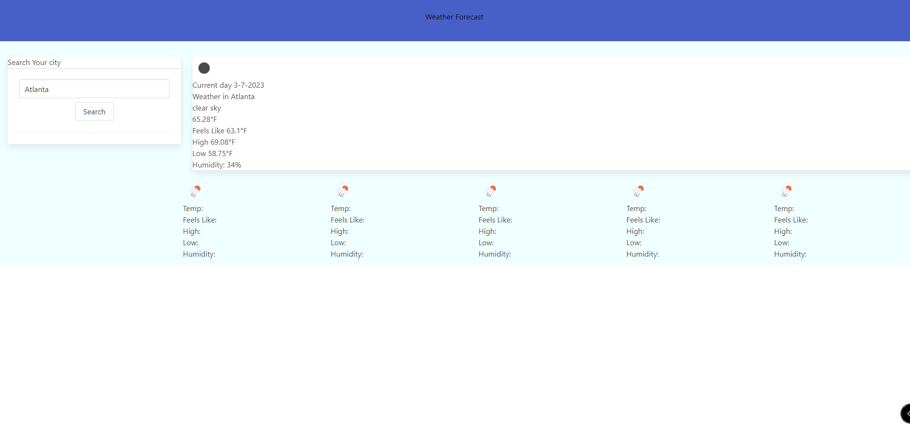

# Weather-API
## Description  
- In this Project I used JavaScript to make a functional weather website.
- A key java elements was Dayjs and 3rd party API.
 

## Usage 
- Used to look up weather and forecast in your area.

## Resource Links
- https://bulma.io/documentation/helpers/spacing-helpers/
- https://bulma.io/documentation/elements/block/
- https://openweathermap.org/

## Languages 
- HTML
- JavaScript 
- Bulma

## Deployed Link
- https://wyattotto.github.io/Weather-API/

